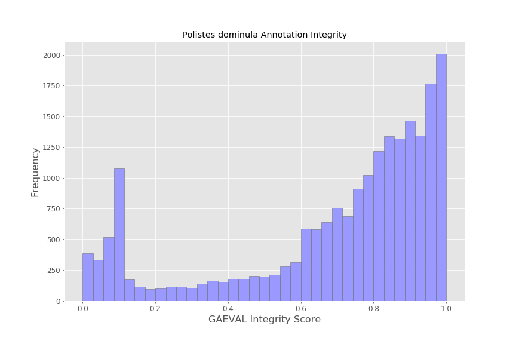

# Evaluating gene models by transcript support

The [GAEVAL integrity score][integrity] measures the extent to which a gene model is or is not supported by available trancript evidence.
The integrity score integrates exon coverage, structural accuracy, and UTR length, with 1.0 representing complete support and 0.0 representing a complete lack of support.

Here we use the GAEVAL integrity score to assess NCBI RefSeq annotations for two paper wasps in the genus *Polistes*, *Polistes dominula* and *Polistes canadensis*.

## Procedure

The procedure for data access and processing is implemented in `workflow.sh`.

- Transcript shotgun assemblies (TSAs) are downloaded directly from NCBI's TSA FTP site.
- The reference genome assemblies and annotations are downloaded using the `fidibus` command ([genhub][genhub])
- The transcripts are aligned to the reference genome using [GeneSeqer][gsq]
- The integrity scores are computed using the `gaeval` command ([AEGeAn Toolkit][agn])

## Results

The distribution of integrity scores for *Polistes dominula* (blue) is skewed toward higher values, with 5,8335 gene models (out of 20,835; 28.0%) with scores > 0.9 and 15,502 gene models (74.4%) with scores > 0.6.
The upward trend in scores is mostly monotonic and fairly consistent, with the exception of a large peak near 0.1.
This peak reflects one of the three components of the integrity score.
Satisfying an expected lower threshold of UTR length contributes 10% of a gene model's integrity score, so gene models near 0.1 will typically be those with annotated UTRs but that have little to no support from available transcript alignments.

The distribution of integrity scores for *Polistes canadensis* (yellow) has similar features, such as the peak near 0.1.
However, the upward trend is less pronounced and there is more generally a flatter distribution of scores.

[integrity]: http://www.plantgdb.org/GAEVAL/docs/integrity.html
[genhub]: http://github.com/standage/genhub
[gsq]: http://brendelgroup.org/bioinformatics2go/GeneSeqer.php
[agn]: http://brendelgroup.github.io/AEGeAn
