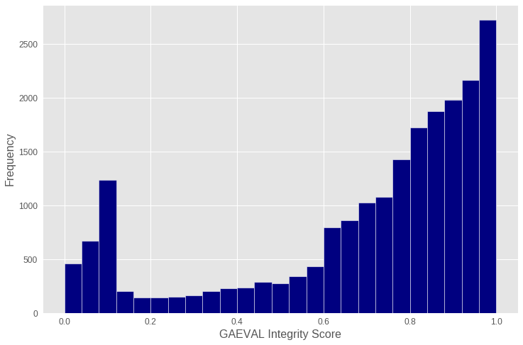

# Evaluating gene models by transcript support

The [GAEVAL integrity score][integrity] measures how much a gene model is or is not supported by available trancript evidence.
The integrity score integrates exon coverage, structural accuracy, and UTR length, with 1.0 representing complete support and 0.0 representing a complete lack of support.

Here we use the GAEVAL integrity score to assess the genome annotation of the paper wasp *Polistes dominula* published by NCBI RefSeq.

## Procedure

The procedure for data access and processing is implemented in `workflow.sh`.

- Transcript shotgun assemblies (TSAs) are downloaded directly from NCBI's TSA FTP site.
- The *Polistes dominula* reference genome is downloaded using [genhub][genhub]
- The transcripts are aligned to the reference genome using [GeneSeqer][gsq]
- The integrity scores are computed using the [AEGeAn Toolkit][agn]

## Results

The integrity scores of the gene models are skewed toward higher values, with 28.0% of gene models > 0.9 and 74.4% of gene models > 0.6.
The upward trend in scores is mostly monotonic and fairly consistent, with the exception of a large peak near 0.1.
This peak reflects one of the three components of the integrity score.
Satisfying an expected lower threshold of UTR length contributes 10% of a gene model's integrity score, so gene models near 0.1 will typically be those with annotated UTRs but that have little to no support from available transcript alignments.

[integrity]: http://www.plantgdb.org/GAEVAL/docs/integrity.html
[genhub]: http://github.com/standage/genhub
[gsq]: http://brendelgroup.org/bioinformatics2go/GeneSeqer.php
[agn]: http://brendelgroup.github.io/AEGeAn
